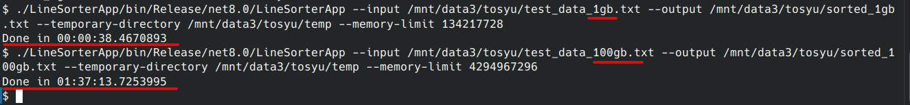
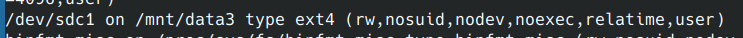
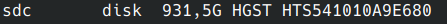
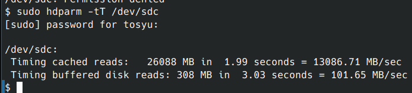
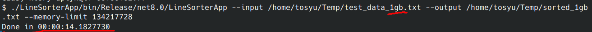

LineSorterApp
===

This is a simple example for an external sorting algorithm which can sort big sets of data in the format:

```
[Number]. [Word] [Word]... [WordN]
```

Usage
---

Generator

```
$ ./LineSorterGeneratorApp -h
Description:
  Application generating [num]. [text] line filled text files

Usage:
  LineSorterGeneratorApp [options]

Options:
  --output <output>            Path pointing where to put the results. Will be overwritten [default: output.txt]
  --target-size <target-size>  Target file size in bytes. Note: output can be a bit bigger just to avoid cutting the line content [default: 1073741824]
  --dictionary <dictionary>    Dictionary of words separated with new lines that will be used to generate the result file. If not specified the bundled 
                               one will be used [default: words.txt]
  --version                    Show version information
  -?, -h, --help               Show help and usage information
```

Sorter

```
$ ./LineSorterApp -h
Description:
  Application for sorting [num]. [text] line filled text files

Usage:
  LineSorterApp [options]

Options:
  --input <input> (REQUIRED)     Path pointing to the the unsorted file
  --output <output>              Path pointing where to put the results. Will be overwritten [default: sorted.txt]
  --memory-limit <memory-limit>  Memory limit for the process in bytes. If not supplied quarter of available RAM will be used [default: RAM/4]
  --version                      Show version information
  -?, -h, --help                 Show help and usage information
```


Results
---

I've manage to salvage and old 1TB HDD (magnetic) drive and tune the app to work with sequential i/o disks of this type (SDD and NVMEs are faster in random i/o so last merging
phase was a lot faster for those drives).

Now the app does:



which is just under 1 minute per GB of work time for my setup.

My HDD setup is (compare with directories in previous screenshots):







As for my main NVME if done only the 1GB test as 100GB is not really needed (and I don't have that much space)



[Deprecated] Results
---

The result for a 1GB set of data is as follows


19 seconds run time on a AMD Ryzen 5 3600 with a NVMe drive and 32GB of RAM. A bigger memory than data set size allows for sorting only in memory, but we can modify the `--memory-limit` parameter to split the input data in to chunks that will fit in memory.

Results for 100GB


Note: I had to move input data to another slower drive (SSD) since my main drive is only 500GB, but I'm happy with the result, the process took less than 1GB/min (100GB = 100 min). Probably it could go faster. And probably the algorithm could be better but that's just what I came up with

Also here is a screenshot of first few lines of the output file


The first lines with A could look that somethings wrong, but in 100GB of lines the generator just spit out few that are with one word from words.txt (first line)

Memory requirements
---

From what I observed the base is 3xinput size, since we need space for the input, the work file(s) and the output (the work files will be deleted after the output is written to), also there is some overhead for the code itself but compared the the input file itself (at least the test one) it's not that significant.


Requirements
---

The only dependency the apps have is the `System.CommandLine` library for easy cli argument parsing. dependency

License
---
MIT
